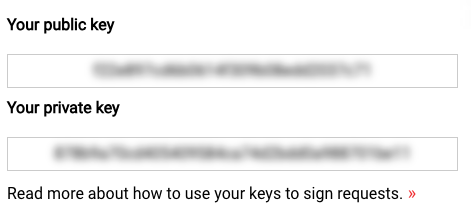
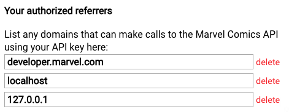

# Trouble shooting

This document should help you resolve technical issues you may encounter.

## Development environment

The code has been writen using a long term stable (LTS) version of Node: [Node v18.12.0 (LTS)](https://nodejs.org/en/blog/release/v18.12.0). It is recommended to use the same or similar version.

💡 You can use [NVM](https://github.com/nvm-sh/nvm#node-version-manager---) to better control versions of Node between applications.

## Dependency versioning

While I encourage starting with the latest version of packages (which tend to include bugfixes over time), sometimes the latest version can be conflicting or not compatible with the setup. Then please note the following versions that were used in this project (this information is stored in the `package.json` and `package-lock.json` files as well).

### Project initialisation

Instead of initialising the app with `npm init vue@latest` you could pinpoint the exact same version as the source material by running `npm init vue@3.3.2`

Since it's an initialisation script, I would recommend starting with a clean slate instead of changing the version after installation.

### Tailwind installation

Instead of installing the latest versions with the `pnpm install -D tailwindcss postcss autoprefixer` command, you can use the same versions with the following command: `pnpm install -D tailwindcss@3.3.2 postcss@8.4.23 autoprefixer@10.4.14`

💡 Using `pnpm` you may also have to use the `-shamefully-hoist` flag in your command to create a flat `node_modules` directory structure.

## API Connection

If you're not getting a response from the endpoint, be sure check these steps:
- [ ] Did you register for an API key?
- [ ] Are the API keys registered in your `.env` file? (Figure 4.1)
- [ ] Is the development server (usually localhost) added to the whitelist in the [Marvel Developer Portal](https://developer.marvel.com/)? (Figure 4.2)
- [ ] Do you have an internet connection?

_Figure 4.1: Make sure you log the keys in your `.env` file_

_Figure 4.2: Make sure your local development server address is configured in this list too!_

